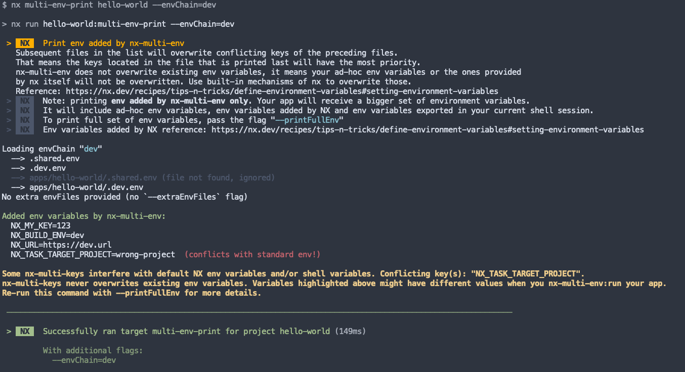

# nx-multi-env

A plugin for [nx.dev](https://nx.dev/) that allows combining multiple .env files in the form of a chain, expanding [the default way](https://nx.dev/recipes/tips-n-tricks/define-environment-variables#setting-environment-variables) of how nx.dev handles environment variables.

## Motivation / Use cases

Imagine you have an app that has multiple environments (`development`, `staging`, `production`).
During your local frontend development you may want to occasionally connect to `production` servers to debug a problem that reproduces there.
However, if you do that, you'll lose your DX – your code gets minified, you don't get incremental compilation and fast refreshes, your code no longer
exposes connect handles for your debug tools and so on. Not great.

This would not happen if you distinguished between your **configuration** and **environment**.
In the example above, if you had a **dev configuration** and a **production environment**, you would get the best of both worlds.

Let the configuration handle the way your code builds, and let the environment define the rest.

You cannot achieve this using built-in environment variables as they are tied to the configuration name. And
nx.dev [dropped the support](https://github.com/nrwl/nx/issues/2839) for multiples simultaneous configurations.

## Installation

Add `nx-multi-env` to your `package.json`

```
npm install -D nx-multi-env
```

or

```
yarn add -D nx-multi-env
```

Add targets `multi-env-run` and `multi-env-print` to your project(s).

Usually (for nx16) they are defined in the app's project.json, e.g. <repository root>/apps/<your app name>/project.json.

```
{
  "name": "myapp",
  "sourceRoot": "apps/myapp/src",
  ...
  "targets": {
    "build": { ... },
    "serve": { ... }

    ...

    "multi-env-run": {
      "executor": "nx-multi-env:run"
    },
    "multi-env-print": {
      "executor": "nx-multi-env:print"
    }

    ...
}
```

You're all set! 🎉 Run

```
nx multi-env-print <your app name>
```

to verify your installation. You should see the "Print env added by nx-multi-env" message.

## Usage

`nx-multi-env` loads multiple env files when invoked. **It does not affect your environment variables if called outside of `nx-multi-env:*` executors**.

Specify `--envChain=<name>` to load env files into your env.
The files are loaded in the given order:

```
<repo root>/.shared.env
<repo root>/.<env-chain-name>.env
<repo root>/apps/<your app>/.shared.env
<repo root>/apps/<your-app>/.<env-chain-name>.env
```

Overlapping env variables get overwritten, going from top to bottom. It means that an env variable in `<repo root>/.shared.env` will be overwritten by the env variable in `<repo root>/apps/<your app>/.shared.env` with the same key.

You can provide extra environment variable files via `--extraEnvFiles`. It accepts multiple comma-separated paths. Paths are relative to the repository root.

To run a command, use the following syntax

```
nx multi-env-run <app name> <target>
```

for example, to run serve a `hello-world` application, run

```
nx multi-env-run hello-world serve // instead of nx serve hello-world
```

To help with debug you can print the environment variables for your app along with some helpful tips by calling

```
nx multi-env-print <app name>
```

It accepts both `--envChain` and `--extraEnvFiles` with the same syntax as the `run` executor.

Here is the example output:


By default `print` executor displays **only** env variables added by `nx-multi-env`. This is not the only env variables that your process will receive (more on that in the next section).
Use `--printFullEnv` if you want to get the full and true environment.

## Env files loading order/priority

`nx-multi-env` never overwrites existing env variables. It means your ad-hoc env variables, the NX standard env variables and your shell variables are never overwritten.

Therefore, we **strongly recommend** adding a prefix to your `nx-multi-env` env chains, e.g. you may want to have chains `app-dev`, `app-stage` and `app-prod`, but **not** `dev`, `stage` and `prod`.
If you call them the latter, you might have conflicts with default nx environments along the way. The `multi-env-print` executor will notify you of a problem, but why increasing your chances of running into one?

Let's say you created a `.app-dev.env` file with the following contents:

```
NX_TEST=0
NX_SAMPLE=no
NX_HELLO=nope
NX_TASK_TARGET_PROJECT=unknown
```

1. If you run `NX_TEST=1 nx multi-env-run ... --envChain=app-dev` the `NX_TEST=1` variable is not changed by `nx-multi-env` (value will be `NX_TEST=1`).
2. If you create `.local.env` file the root of your repo (this file autoloads by NX [as per their guides](https://nx.dev/recipes/tips-n-tricks/define-environment-variables#setting-environment-variables)) with `NX_SAMPLE=yes`, the `NX_SAMPLE` variable is not changed by `nx-multi-env` (value will be `NX_SAMPLE=yes`).
3. If you run `export NX_HELLO=hi` before running `nx multi-env-run`, the `NX_HELLO` is not changed by `nx-multi-env` (value will be `NX_HELLO=hi`)
4. The `NX_TASK_TARGET_PROJECT` is set by NX internally, and the value is not changed by `nx-multi-env` (value will be `NX_TASK_TARGET_PROJECT=<original value>`)

`nx-mulit-env` appends non-existing variables to your process env in the following order:

If `--envChain` is specified, then

```
<repo root>/.shared.env
<repo root>/.<env-chain-name>.env
<repo root>/apps/<your app>/.shared.env
<repo root>/apps/<your-app>/.<env-chain-name>.env
```

The env variables from `--extraEnvFiles` take precedence over the files discovered via `--envChain`.
If the env file cannot be located, it gets ignored.

The `print` executor is a wonderful tool that will show you the loading order of env files, the files it could not locate and even spot conflicts between your standard env and the `nx-mulit-env`.

## Examples

Given your app name is `hello-world` and you named your targets `multi-env-run` and `multi-env-print` as per the **Installation** section:

Serve the app in your default configuration with `app-prod` env chain:

```
nx multi-env-run hello-world serve --envChain=app-prod
```

Print the environment of the previous command added by `nx-multi-env`

```
nx multi-env-print hello-world --envChain=app-prod
```

Build the production version of the app with `app-prod` env chain and adding 2 extra env files on top:

```
nx multi-env-run hello-world build --envChain=app-prod --extraEnvFiles=.custom.env,apps/hello-world/.test-user.env --production
```

Print full environment of the previous command

```
nx multi-env-print hello-world --envChain=app-prod --extraEnvFiles=.custom.env,apps/hello-world/.test-user.env --printFullEnv
```

Serve the app using only `.shared.env` files (without the `.<env-chain-name>.env` files):

```
nx multi-env-run hello-world serve --envChain=shared
```

Given you have the following files:

```
# <repo root>/.app-dev.env
NX_EXAMPLE=yes
NX_SAMPLE=yes
NX_INSTANCE=yes

# <repo root>/.env
NX_SAMPLE=no
```

And you run the command like this:

```
NX_EXAMPLE=no nx multi-env-print hello-world --envChain=app-dev
```

You will get the following warnings, indicated a conflict between standard env variables and the ones that `nx-multi-env` would have added.

```
...
  NX_EXAMPLE=yes  (conflicts with standard env!)
  NX_SAMPLE=yes  (conflicts with standard env!)
  NX_INSTANCE=yes
...
```

Please note that `print` executor prints the values from your `nx-multi-env` files with the warning.
It indicates that when you run your target with the `run` executor the values of env variables might be different.
To get the correct/true values, run the `print` executor with `--printFullEnv` flag.

```
NX_EXAMPLE=no nx multi-env-print hello-world --envChain=app-dev --printFullEnv
```

The produced output is:

```
Starting env variables (the ones added by NX and your shell, not overwritten):
NX_SAMPLE=no  (conflicts with your nx-multi-env files)
NX_EXAMPLE=no  (conflicts with your nx-multi-env files)

...

Added env variables by nx-multi-env:
NX_INSTANCE=yes
```

## Caveats

### Caching

NX has computational cache. I am not yet sure how this plugin works with the cache [TBD].

### Running from e2e tests

E2E runners that cannot pass any additional parameters to the `devServerTarget` function will need a custom target.
For example, your `e2e` cypress target can look like this:

```
"e2e": {
    "executor": "@nx/cypress:cypress",
    "options": {
    "cypressConfig": "apps/your-app/cypress.config.ts",
    "devServerTarget": "your-app:e2e-dev-server", // Without nx-multi-env you'd likely have `your-app:serve` here instead
    "testingType": "e2e"
}
```

And inside `your-app/project.json`, add a new target:

```
  "targets": {
    "e2e-dev-server": {
      "executor": "nx-multi-env:run",
      "options": {
        "_": ["serve"],
        "envChain": "app-dev"
      }
    },
    ...
```

### Env chain naming

Don't forget that NX default env variables always take precedence over the ones added by `nx-multi-env`!
You may accidentally name your env chain `production`, create a `.production.env` file, which matches under default NX env `.[configuration-name].env` pattern.
Hence, I recommend naming your env chains with a prefix, e.g. `app-production` instead of `production`. It greatly decreases your chances of running into naming conflicts.

The `print` executor will notify you of this caveat if it happens.

## Building

Run `nx build multi-env` to build the library.

## Running tests

`nx test` + `nx e2e e2e`
